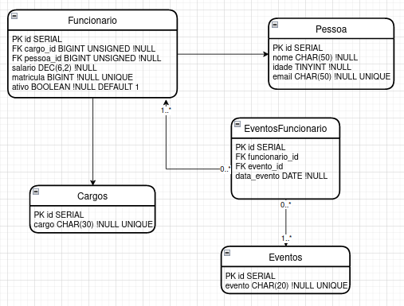

# HUMAN RESOURCES - Rust
### *An HR Crud Project made with Rust, Rocket and Diesel*

> This project aims to be a simple HR management system, updatable using API's routes.

#### How to Run this project?
1. Install Rust using [Rust Installer](https://www.rust-lang.org/tools/install)
2. Type these commands at console:
   1. `cargo build`
   2. `cargo install diesel_cli --no-default-features --features "sqlite-bundled"`
   3. `diesel setup --database-url memory.sqlite`
   4. `diesel migration run --database-url memory.sqlite`
   5. `cargo run`